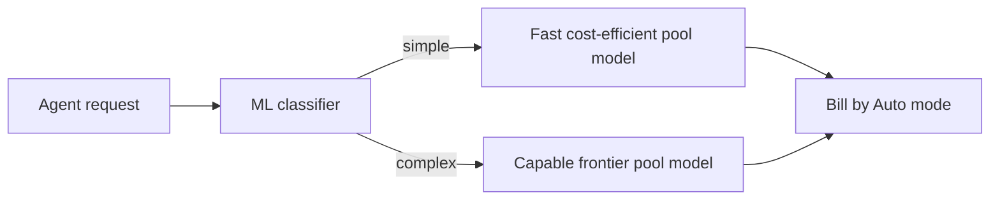

# Cursor model table

Quick reference for Cursor Agent/Chat models: relative speed, API cost, when **Auto** may pick them, and whether **AskQuestions** (structured clarifying questions) is supported.

**How to read this page**

| Column | Meaning |
| --- | --- |
| Model | Display name from Cursor docs |
| Speed | Qualitative only — docs do not publish a numeric ranking |
| Cost | Per-million-token rates as `$input → $output` (cache read omitted). Fast tiers noted when docs list them |
| When Auto selects it | Short role in the Cursor Router pool. Full process is in [Auto selection process](#auto-selection-process) below. `—` means never chosen by Auto |
| AskQuestions | `Yes` / `No` / `Unknown` — see [AskQuestions notes](#askquestions-notes) |

Costs are from [Models & Pricing](https://cursor.com/docs/models-and-pricing.md). On Teams/Enterprise, third-party models also incur a **Cursor Token Rate** of $0.25/M (exempt: Auto Cost, Composer 2.5, Grok 4.5).

---

## Auto / Cursor Models

| Model | Speed | Cost ($/M in → out) | When Auto selects it | AskQuestions |
| --- | --- | --- | --- | --- |
| Auto Cost | N/A (billing mode, not a model) | $1.25 → $6 | Billing row for Auto **Cost** mode (fixed rates regardless of underlying model) | N/A |
| Composer 2.5 | Fast default for interactive work; standard tier cheaper per token | $0.50 → $2.50 | Required pool; simple / cost-efficient | Yes |
| Composer 2.5 Fast | Faster than Grok 4.5 Fast; default product variant | $3 → $15 | Same pool as Composer 2.5 (fast variant) | Yes |
| Grok 4.5 | Standard; effort high/medium/low | $2 → $6 | Pool; long-running / capable | No |
| Grok 4.5 Fast | Fast tier (slower than Composer Fast) | $4 → $18 | Same pool as Grok 4.5 (fast variant) | No |
| Composer 1 | Older Composer | $1.25 → $10 | — | Unknown |

---

## Anthropic

| Model | Speed | Cost ($/M in → out) | When Auto selects it | AskQuestions |
| --- | --- | --- | --- | --- |
| Claude Opus 5 | Competitive; Fast tier available | $5 → $25 | Recommended; complex / frontier | Yes |
| Claude Opus 5 Fast | Higher-priority Fast mode | $10 → $50 | Same pool as Opus 5 (fast variant) | Yes |
| Claude Sonnet 5 | Strong coding; Fast not separately listed on pricing row | $3 → $15 (promo $2 → $10 thru 2026-08-31) | — | Yes |
| Claude Fable 5 | Highest capability tier (~2× Opus 5 cost) | $10 → $50 | Pool; hardest (when allowlisted) | Yes |
| Claude Opus 4.8 | Standard Opus generation | $5 → $25 | — | Unknown |
| Claude Opus 4.7 (fast mode) | Research-preview Fast | $30 → $150 | — | Unknown |
| Claude 4.7 Opus | Hidden by default | $5 → $25 | — | Unknown |
| Claude 4.6 Opus | Hidden by default | $5 → $25 | — | Unknown |
| Claude 4.6 Sonnet | Hidden by default | $3 → $15 | — | Unknown |
| Claude 4.5 Opus | Hidden by default | $5 → $25 | — | Unknown |
| Claude 4.5 Sonnet | Hidden by default | $3 → $15 | — | Unknown |
| Claude 4.5 Haiku | Faster / cheaper Claude | $1 → $5 | — | Unknown |
| Claude 4 Sonnet | Hidden by default | $3 → $15 | — | Unknown |
| Claude 4 Sonnet 1M | Large context; 2× input past 200k | $6 → $22.50 | — | Unknown |

---

## OpenAI

| Model | Speed | Cost ($/M in → out) | When Auto selects it | AskQuestions |
| --- | --- | --- | --- | --- |
| GPT-5.5 | Capable; Fast mode at higher rates | $5 → $30 | Recommended; complex / capable | Unknown |
| GPT-5.6 Sol | Competitive speed for its intelligence tier; Fast = 2× | $5 → $30 (Fast 2×) | — | Yes |
| GPT-5.6 Terra | Mid-tier GPT-5.6; Fast = 2× | $2.50 → $15 (Fast 2×) | — | Yes |
| GPT-5.6 Luna | Fastest / cheapest GPT-5.6; Fast = 2× | $1 → $6 (Fast 2×) | — | Yes |
| GPT-5.4 | Fast mode ~15% faster at 2× price | $2.50 → $15 | — | Unknown |
| GPT-5.4 Mini | Smaller, faster GPT-5.4 | $0.75 → $4.50 | — | Unknown |
| GPT-5.4 Nano | Smallest / cheapest GPT-5.4 | $0.20 → $1.25 | — | Unknown |
| GPT-5.3 Codex | Codex / agentic | $1.75 → $14 | — | Unknown |
| GPT-5.2 | Hidden by default | $1.75 → $14 | — | Unknown |
| GPT-5.2 Codex | Hidden by default | $1.75 → $14 | — | Unknown |
| GPT-5.1 Codex | Hidden by default | $1.25 → $10 | — | Unknown |
| GPT-5.1 Codex Max | Hidden by default | $1.25 → $10 | — | Unknown |
| GPT-5.1 Codex Mini | Faster / cheaper Codex | $0.25 → $2 | — | Unknown |
| GPT-5 | Hidden by default | $1.25 → $10 | — | Unknown |
| GPT-5 Fast | Faster at 2× price | $2.50 → $20 | — | Unknown |
| GPT-5 Mini | Small / cheap | $0.25 → $2 | — | Unknown |
| GPT-5-Codex | Hidden by default | $1.25 → $10 | — | Unknown |

---

## Google Gemini

| Model | Speed | Cost ($/M in → out) | When Auto selects it | AskQuestions |
| --- | --- | --- | --- | --- |
| Gemini 3.6 Flash | Flash = faster / lighter | $1.50 → $7.50 | — | Unknown |
| Gemini 3.5 Flash | Flash | $1.50 → $9 | — | Unknown |
| Gemini 3.1 Pro | Pro tier | $2 → $12 | — | Unknown |
| Gemini 3 Pro | Hidden by default | $2 → $12 | — | Unknown |
| Gemini 3 Pro Image Preview | Image generation; text same as 3 Pro | $2 → $12 (image out separate) | — | Unknown |
| Gemini 3 Flash | Flash | $0.50 → $3 | — | Unknown |
| Gemini 2.5 Flash | Flash | $0.30 → $2.50 | — | Unknown |

---

## Other

| Model | Speed | Cost ($/M in → out) | When Auto selects it | AskQuestions |
| --- | --- | --- | --- | --- |
| GLM 5.2 | Hidden by default | $1.40 → $4.40 | — | Unknown |
| Kimi K2.7 Code | Hidden by default | $0.95 → $4 | — | Unknown |

---

## Auto selection process

Selecting **Auto** does not pin a single model. **Cursor Router** runs an ML classifier on each agent request and chooses a model from an allowlisted **routing pool** by task type and complexity. The stated goal is the cheapest model with comparable quality. You cannot configure routing per request — you only choose an Auto **mode**.

This section explains that process and how it relates to the **When Auto selects it** column above.

### Modes

| Mode | Behavior | Billing |
| --- | --- | --- |
| **Cost** | Legacy Auto; optimizes token spend | Fixed **Auto Cost** rates: $1.25/M input (+ cache write), $6/M output, $0.25/M cache read — regardless of which underlying model ran |
| **Balance** | Default mix of intelligence, speed, and cost | Routed model’s API rates (+ Cursor Token Rate on third-party for Teams/Enterprise) |
| **Intelligence** | Prefer more capable models (~20–30% higher quality per Help) | Same as Balance; typically ~2× Cost on average, up to ~2–4× depending on mode |

All three modes draw from the **same routing pool**; they differ in how strongly they bias toward cheaper/faster vs frontier models.

### Routing pool

Only these models can be chosen under Auto ([Available models](https://cursor.com/help/models-and-usage/available-models.md)):

| Model | Pool role | Maps to Auto column |
| --- | --- | --- |
| **Composer 2.5** (fast + standard) | **Required** — blocking it disables the router | Required pool; simple / cost-efficient |
| **GPT-5.5** | **Recommended** — blocking one of GPT-5.5 / Opus 5 reduces quality | Recommended; complex / capable |
| **Claude Opus 5** | **Recommended** — blocking both recommended models disables the router | Recommended; complex / frontier |
| **Grok 4.5** | Pool member | Pool; long-running / capable |
| **Claude Fable 5** | Pool member when allowlisted | Pool; hardest (when allowlisted) |

Classifier rule (docs publish **no** task→model map such as “refactor → Opus”):

- **Simple** work → fast, cost-efficient models (typically Composer)
- **Complex** work → frontier / more capable models (GPT-5.5, Opus 5, Grok, Fable as allowlisted)

Blocked models (enterprise allowlists) are skipped; the router falls back to an allowlisted alternative when possible.

### How the Auto column relates

- The **When Auto selects it** cell is a **compressed role summary** for that model in the pool — not a guarantee that Auto will pick it for a given prompt.
- Rows with `—` are **never** chosen by Auto. Select them manually in the model picker.
- **Auto Cost** in the table is a **billing/mode** row, not a separate underlying model identity. Under Cost mode you still land on a pool model; you just pay the fixed Auto Cost rates.
- Fast variants (Composer Fast, Grok Fast, Opus 5 Fast, etc.) share their parent’s Auto role when the router uses that family.

### Visibility and side effects

- By default the **routed model identity is hidden** so you judge results on merit. Team admins can set visibility to **Displayed**.
- Because Auto may route to **Grok 4.5**, **AskQuestions can be unavailable** mid-session even when the picker says Auto (forum: AskQuestion intentionally off for Grok; agent asks inline instead). Workaround: pin Composer 2.5, Claude, or GPT manually when you need the structured question UI.

---

## AskQuestions notes

| Value | Rule |
| --- | --- |
| **Yes** | Model docs claim access to **all agent tools** (includes Ask questions) — e.g. Composer 2.5, Claude Opus 5 / Sonnet 5 / Fable 5, GPT-5.6 Sol / Terra / Luna |
| **No** | Forum staff: AskQuestion intentionally disabled for **Grok 4.5** |
| **Unknown** | In the pricing catalog but no explicit agent-tools claim or forum exception — do not invent |

Docs do not publish a full per-model AskQuestions matrix. Treat Yes/No here as docs + forum best effort; re-check if Cursor changes tool gating.

---

## Sources

- [Models & Pricing](https://cursor.com/docs/models-and-pricing.md) — costs, Auto Cost rates, Cursor Token Rate
- [Available models](https://cursor.com/help/models-and-usage/available-models.md) — router pool, Auto billing summary
- [Cursor Router](https://cursor.com/help/models-and-usage/cursor-router.md) — Cost / Balance / Intelligence
- [Composer 2.5](https://cursor.com/docs/models/cursor-composer-2-5.md) — Fast pricing ($3 → $15), all agent tools
- [Grok 4.5](https://cursor.com/help/models-and-usage/grok-4-5.md) — Fast vs Composer Fast; Fast rates on Available models Help
- [Claude Opus 5](https://cursor.com/docs/models/claude-opus-5.md) — Fast $10 → $50; all agent tools
- [GPT-5.6 Sol](https://cursor.com/docs/models/gpt-5-6-sol.md) — Fast 2×; all agent tools
- Forum (staff): AskQuestion intentionally off for Grok 4.5

**Promo:** Claude Sonnet 5 launch promotion $2/M input and $10/M output through August 31, 2026.

Rates and the Auto pool change over time — refresh against the links above when in doubt.
